# tech-diagram

[English](README.md) | [日本語](README.ja.md) | [Bahasa Indonesia](README.id.md)

> Agent Skill yang mengubah spesifikasi grid JSON sederhana menjadi diagram
> draw.io yang rapi — diagram arsitektur AWS / Azure / GCP, diagram ER,
> diagram kelas UML, dan flowchart. Murni pustaka standar Python, tanpa
> dependensi eksternal.

Minta diagram kepada agen Anda; skill ini menulis spesifikasi JSON yang
menetapkan sel grid (`col`/`row`) untuk setiap node, lalu mesin tata letak
menghitung koordinat piksel, penyusunan dan ukuran kontainer bersarang,
perutean ortogonal, serta penempatan label, dan menggambarnya dengan ikon
resmi masing-masing penyedia cloud. Setiap diagram kemudian diperiksa secara
mekanis — tumpang-tindih, penembusan, persilangan, ketepatan batas, hingga
anti-pola arsitektur — sebelum sampai ke tangan Anda.

[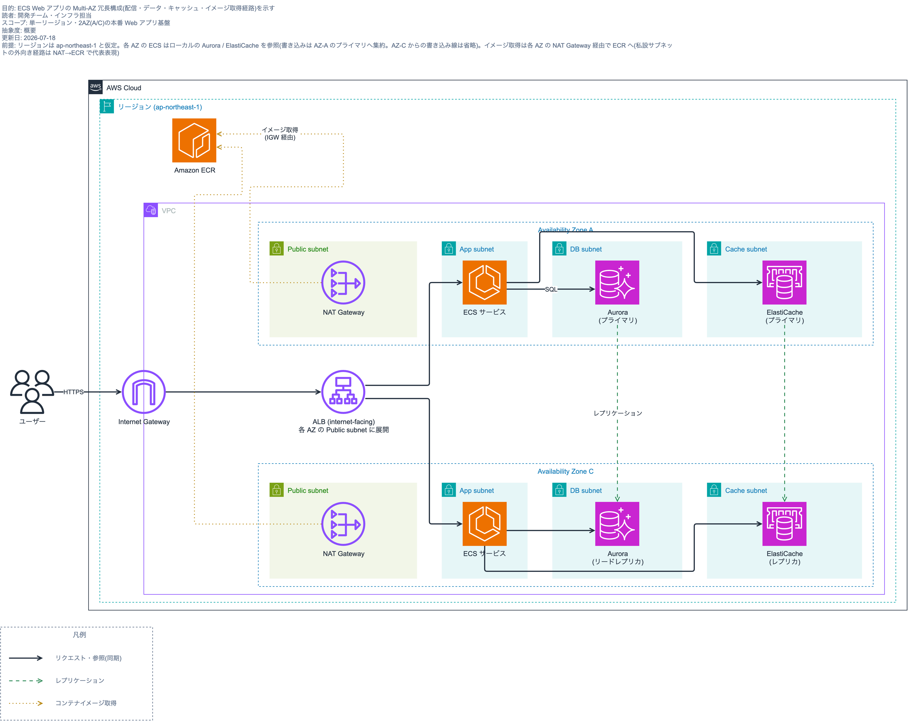](docs/images/samples/03-ecs-multiaz.png)

## Galeri

Semua gambar di bawah adalah **hasil generate tanpa suntingan**. Tiga Contoh
dikurasi untuk galeri; 10 Templat dapat direproduksi dari spesifikasi bawaan
di [templates/](templates/) (klik untuk ukuran penuh).

### Contoh

| | | |
|---|---|---|
| [](docs/images/samples/03-ecs-multiaz.png) | [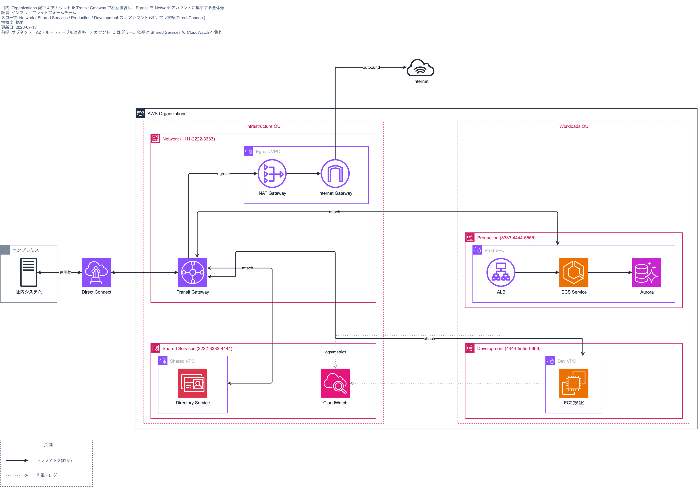](docs/images/samples/04-multiaccount-tgw.png) | [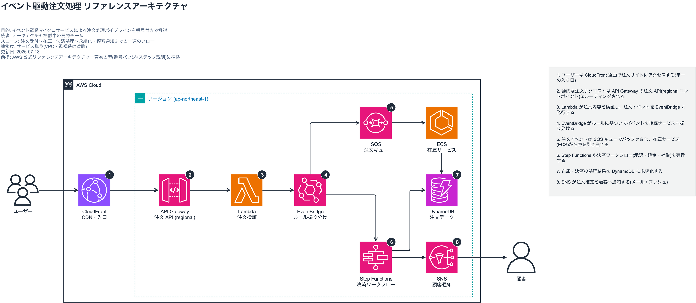](docs/images/samples/06-reference-event-driven.png) |
| Aplikasi web ECS dengan redundansi Multi-AZ | Multi-akun + Transit Gateway | Referensi event-driven (lencana bernomor) |

### 10 templat

| | | |
|---|---|---|
| [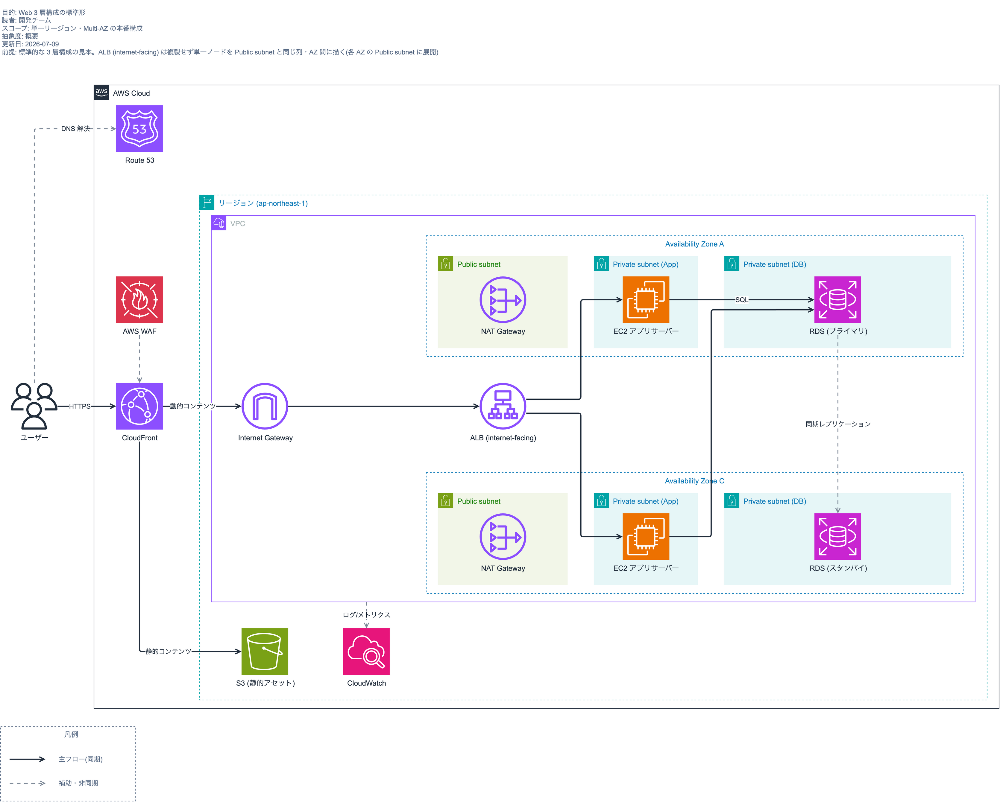](docs/images/templates/example-3tier.png) | [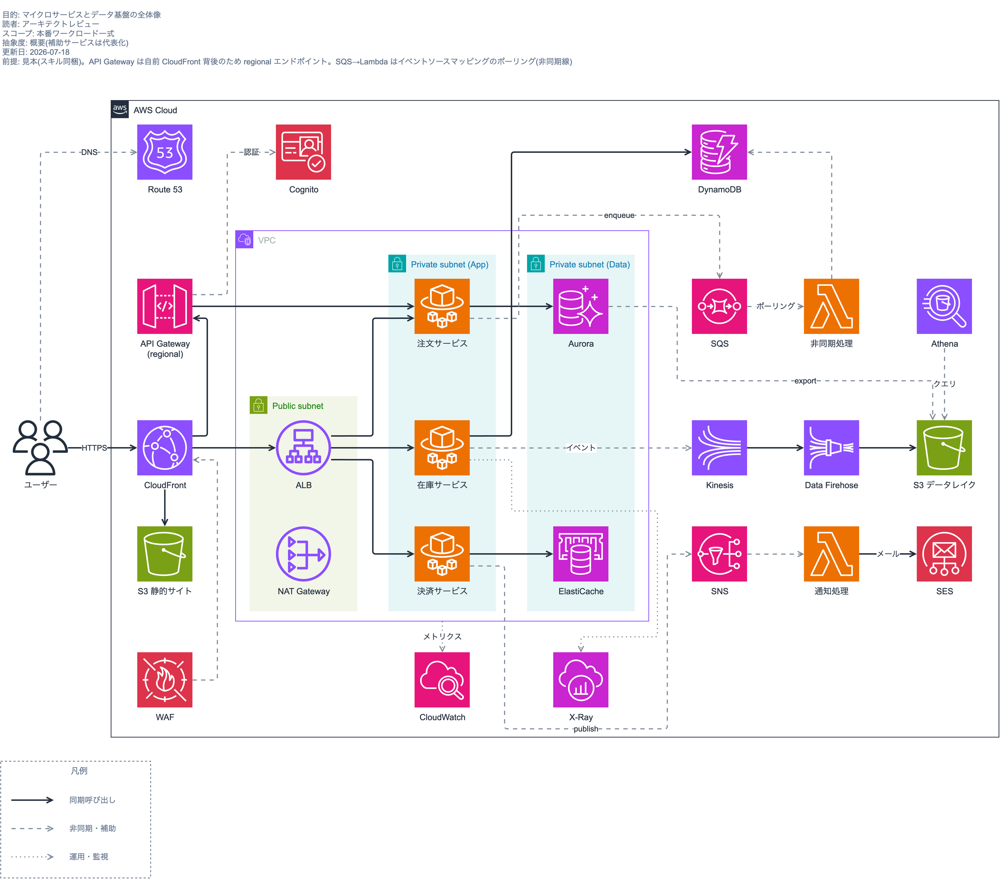](docs/images/templates/example-complex.png) | [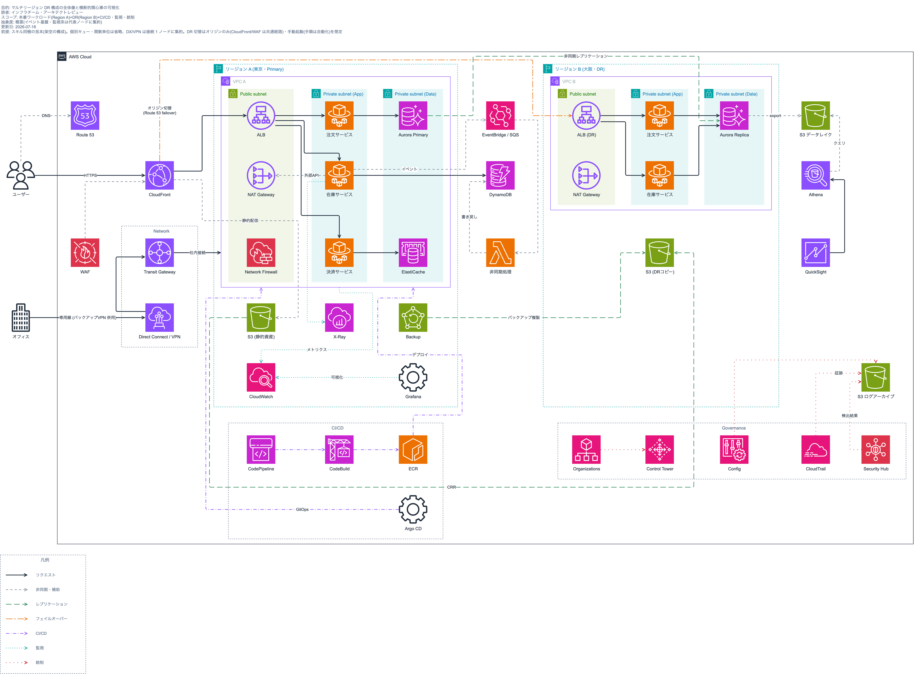](docs/images/templates/example-dense-1page.png) |
| Web 3-tier (`example-3tier`) | Sistem kompleks (`example-complex`) | Padat 42 node dalam 1 halaman (`example-dense-1page`) |
| [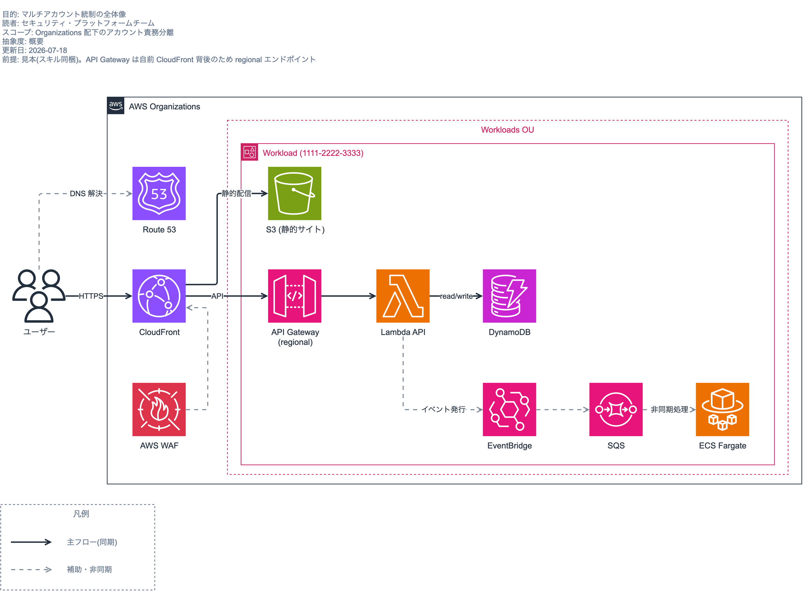](docs/images/templates/example-multiaccount-main.png) | [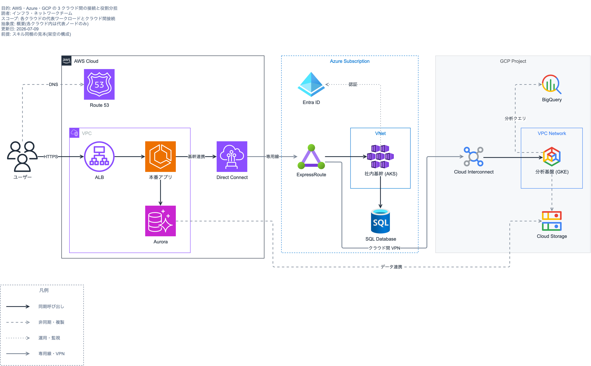](docs/images/templates/example-multicloud.png) | [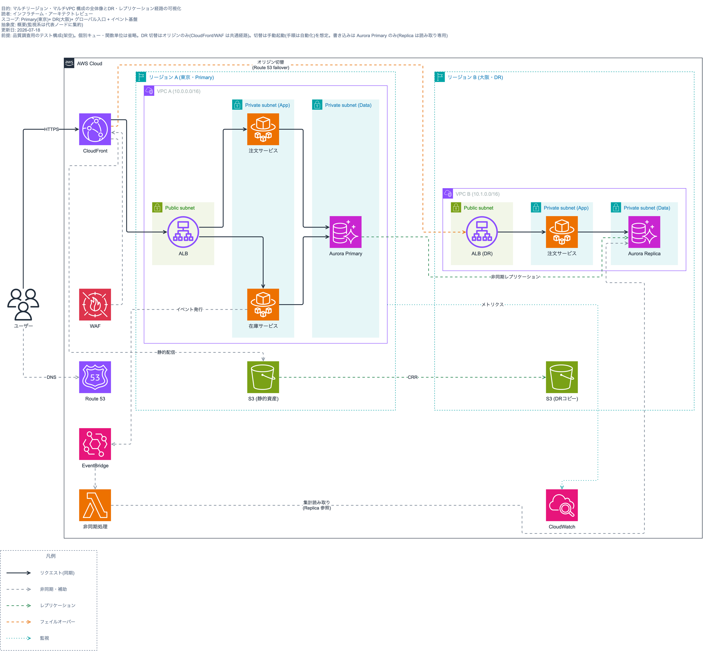](docs/images/templates/example-multiregion.png) |
| Multi-akun (`example-multiaccount`, [tab CI/CD](docs/images/templates/example-multiaccount-cicd.png)) | Multi-cloud AWS/Azure/GCP (`example-multicloud`) | DR multi-region (`example-multiregion`) |
| [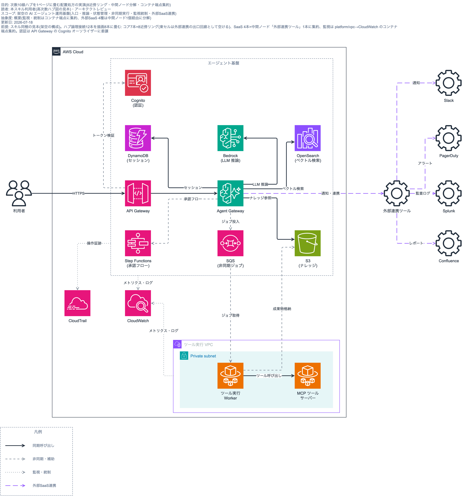](docs/images/templates/example-hub-star.png) | [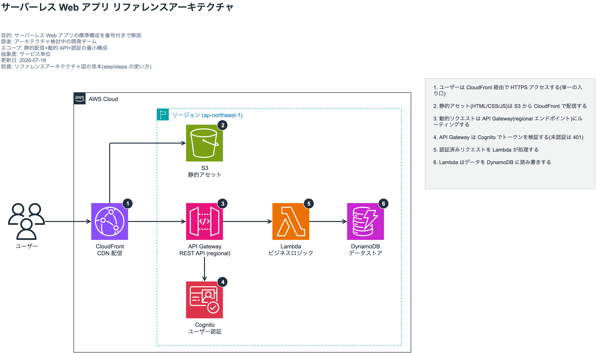](docs/images/templates/example-reference.png) | [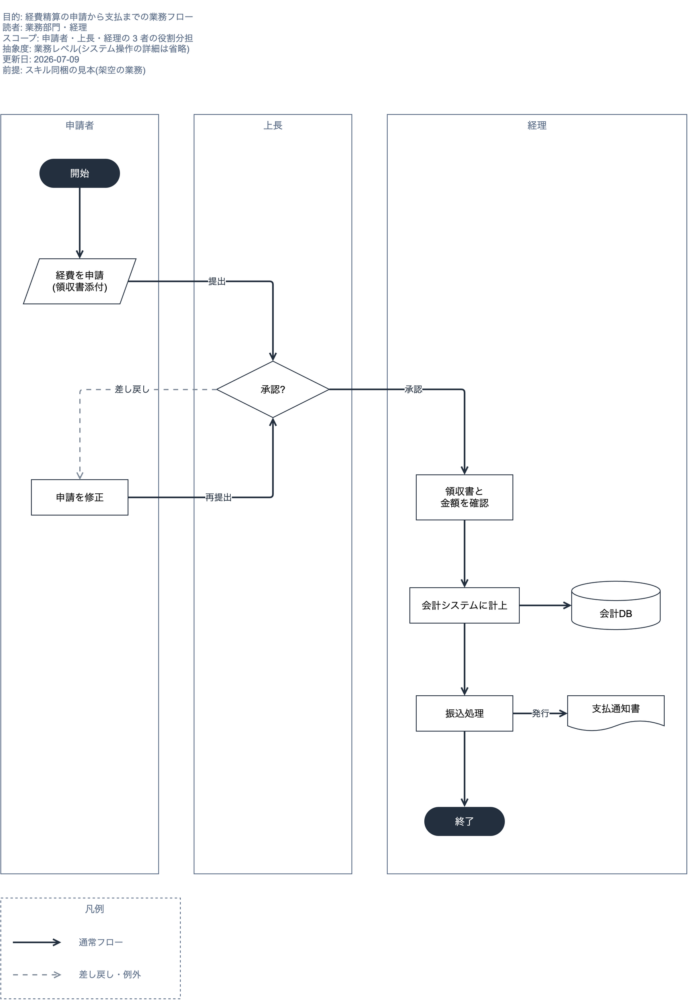](docs/images/templates/example-flowchart.png) |
| Hub & star berderajat tinggi (`example-hub-star`) | Arsitektur referensi (`example-reference`) | Alur persetujuan dengan swimlane (`example-flowchart`) |
| [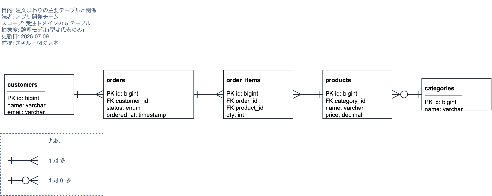](docs/images/templates/example-er-uml-er.png) | [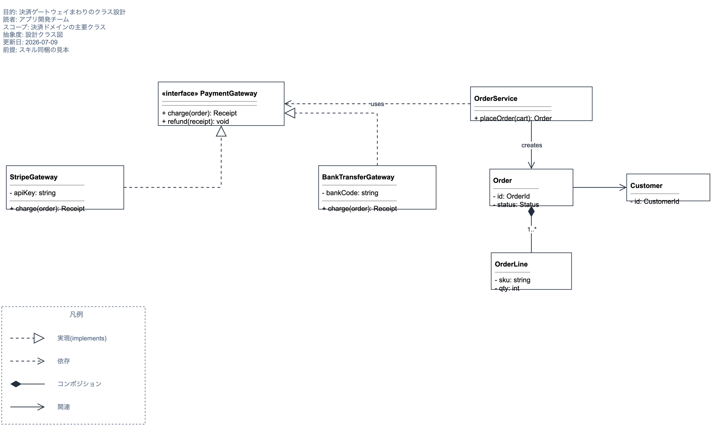](docs/images/templates/example-er-uml-uml.png) | |
| Diagram ER (`example-er-uml` tab 1) | Diagram kelas UML (`example-er-uml` tab 2) | |

## Fitur

- **Jenis diagram**: diagram arsitektur AWS / Azure / GCP dan multi-cloud,
  diagram ER, diagram kelas UML, diagram arsitektur referensi (lencana
  bernomor + deskripsi langkah), flowchart (mendukung swimlane). Diagram
  sequence berada di luar cakupan
- **Kualitas perutean**: pencarian jalur terpendek pada grid koridor, mencoba
  beberapa urutan perutean dengan persilangan, kepadatan, dan belokan sebagai
  biaya, lalu memilih yang persilangannya paling sedikit. Lalu lintas yang
  selesai di dalam satu cloud dijaga tetap di dalam batasnya, dan garis tidak
  menembus kotak cloud atau akun yang tidak terkait
- **Validasi mekanis**: sekitar 20 pemeriksaan — tumpang-tindih label,
  penembusan node, persilangan garis (ambang indikatif dengan koreksi derajat
  hub), konvensi batas cloud (deteksi layanan terkelola yang digambar di
  dalam subnet, pemeriksaan hierarki kontainer), serta anti-pola arsitektur
  (lihat [Ketepatan semantik](#ketepatan-semantik--diagram-yang-benar-secara-arsitektur))
- **Penempatan otomatis**: hilangkan semua `col`/`row` untuk tata letak
  otomatis; `--optimize` menjalankan pencarian lokal penempatan yang
  deterministik (`pin` untuk mengunci posisi node)
- **Pratinjau**: `--emit-png` merender PNG sungguhan (mendeteksi otomatis CLI
  draw.io); `--emit-svg` menghasilkan SVG mandiri untuk pemeriksaan visual
  tanpa CLI (ikon diganti persegi panjang berwarna resmi). Pratinjau multi-tab
  memakai `<output>.<indeks-mulai-01>-<nama-tab-aman>.*`, sehingga nama tab
  yang mirip tidak saling menimpa
- **Impor dari Terraform**: `tf_to_spec.py` mem-parsing berkas `.tf` secara
  langsung dan menghasilkan kerangka spesifikasi plus catatan reviu (tanpa
  kredensial, tanpa CLI terraform, tanpa berkas state)
- **Tanpa dependensi**: hanya pustaka standar Python (3.10+)

## Ketepatan semantik — diagram yang benar secara arsitektur

Selain geometri yang rapi, skill ini menjaga agar tidak menghasilkan diagram
yang "tergambar rapi tetapi salah secara arsitektur":

- **Katalog pola** ([references/patterns.md](references/patterns.md)):
  poin-poin ketepatan untuk pola standar AWS — web 3-tier (Multi-AZ), API
  serverless, DR multi-region, multi-akun, event-driven, situs statis,
  kontainer (ECS/Fargate), hybrid — masing-masing dirujuk ke sumber primer
  AWS (URL diverifikasi 2026-07-18), disertai tabel rujukan cepat anti-pola
- **Spesifikasi awal terverifikasi**
  ([references/reference-architectures/](references/reference-architectures/)):
  5 spesifikasi referensi (web 3-tier, API serverless, DR multi-region, situs
  statis, kontainer ECS), semuanya terbukti ter-build dengan 0 error /
  0 warning. Saat permintaan Anda cocok dengan pola yang dikenal, agen
  memulai dari spesifikasi terverifikasi lalu mengedit selisihnya, bukan
  mengarang bebas
- **Pemeriksaan anti-pola (W16–W21)**: menempatkan layanan edge global
  (CloudFront / Route 53 / WAF) di dalam region, VPC, atau subnet; basis data
  atau cache di subnet publik; serta garis langsung dari klien eksternal ke
  basis data adalah **error yang menolak build**. Garis failover yang
  melewati CloudFront/WAF dan langsung menuju load balancer DR, label
  "HA / Multi-AZ" dengan satu kontainer AZ atau kurang, dan node subnet
  privat yang keluar tanpa NAT / IGW / endpoint ditandai sebagai warning
- **Terkalibrasi terhadap false positive**: penyisiran yang dapat direproduksi
  atas 10 templat bawaan dan 5 spesifikasi referensi menghasilkan 0 temuan
  W16–W21

## Cara menggunakan

Cukup letakkan skill ini di direktori yang dipindai agen Anda untuk Agent
Skills, dengan nama folder `tech-diagram` (dikenali sebagai nama skill).
Lokasinya bebas — tidak ada path yang di-hardcode di dalam skill.

Selanjutnya cukup minta kepada agen Anda:

- "Buatkan diagram arsitektur AWS untuk ..."
- "Buatkan diagram ER untuk tabel-tabel ini"
- "Gambarkan alur persetujuan ini"

Skill akan aktif, membangun diagram, memvalidasinya, dan melaporkan hasilnya.
Prosedur pembuatan diagram selengkapnya ada di [SKILL.md](SKILL.md). Berkas
`.drawio` yang dihasilkan dapat dibuka di aplikasi desktop draw.io, ekstensi
VS Code (hediet.vscode-drawio), atau [app.diagrams.net](https://app.diagrams.net).

### Menulis spesifikasi sendiri

Anda juga dapat melewati agen dan mem-build langsung dari spesifikasi:

```bash
python3 scripts/build_drawio.py templates/example-3tier.spec.json -o out.drawio
python3 scripts/find_icon.py --provider azure kubernetes   # cari nama ikon
```

Spesifikasi minimal:

```json
{
  "name": "Arsitektur 3-tier",
  "meta": {"purpose": "Gambaran umum aplikasi web", "audience": "Tim dev",
           "scope": "Produksi", "abstraction": "Tingkat layanan"},
  "containers": [
    {"id": "cloud", "label": "AWS Cloud", "type": "aws_cloud"},
    {"id": "vpc", "label": "VPC", "type": "vpc", "parent": "cloud"}
  ],
  "nodes": [
    {"id": "users", "label": "Pengguna", "icon": "users", "col": 0, "row": 0},
    {"id": "alb", "label": "ALB", "icon": "application_load_balancer",
     "col": 1, "row": 0, "parent": "vpc"},
    {"id": "app", "label": "Aplikasi", "icon": "ec2", "col": 2, "row": 0, "parent": "vpc"}
  ],
  "edges": [
    {"id": "e1", "src": "users", "dst": "alb", "kind": "main", "label": "HTTPS"},
    {"id": "e2", "src": "alb", "dst": "app", "kind": "main"}
  ]
}
```

## Kualitas perutean — Before / After

Router mengikuti prinsip prioritas "terlihat terhubung (keluar/masuk di dekat
pusat sisi) > garis lurus > belokan paling sedikit". Spesifikasi yang sama,
mesin generasi lama vs. v1.0.0:

| Before (mesin tahap awal) | After (v1.0.0) |
|---|---|
| [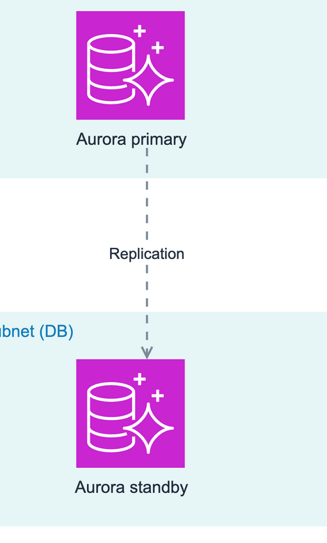](docs/images/before-after/pairs-anchor-before.png) | [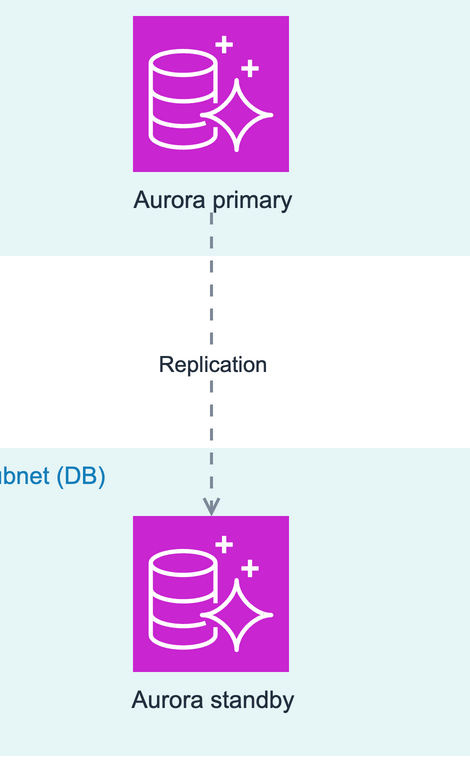](docs/images/before-after/pairs-anchor-after.png) |
| Garis vertikal pasangan duplikat keluar/masuk dari posisi yang tidak di pusat (frac 0.65) | Pelebaran kolom mengamankan pusat sisi (frac 0.5); garis lurus menembus pusat ikon |
| [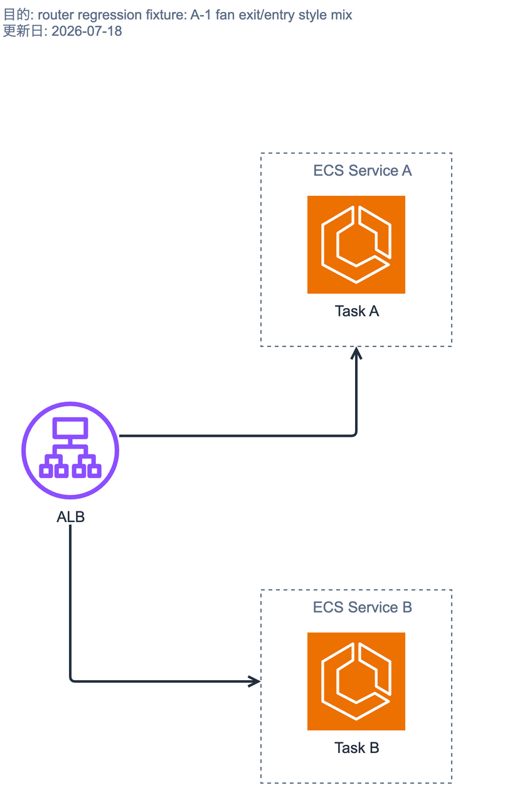](docs/images/before-after/fan-mixed-before.png) | [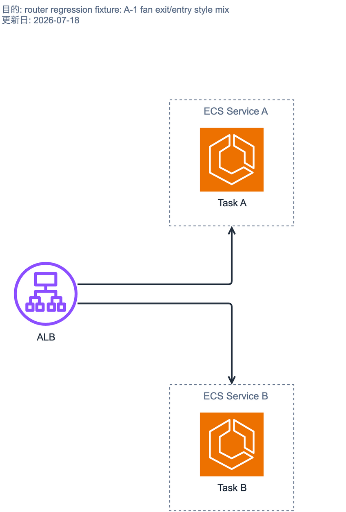](docs/images/before-after/fan-mixed-after.png) |
| Garis berpasangan dari ALB yang sama terpecah ke sisi kanan dan bawah, sisi masuknya pun campur aduk | Diseragamkan: keluar dari slot simetris sisi kanan (0.35/0.65), masuk tercermin pada sisi atas/bawah yang berhadapan |

## Evaluasi

Suite evaluasi yang dapat direproduksi di [evals/](evals/) memeriksa apakah
agen dapat mengubah permintaan bahasa alami menjadi `.drawio` 0 error /
0 warning tanpa perbaikan manual. Persyaratan mekanis dijalankan melalui
`evals/check_diagram.py`; penilaian dan pelaporan dinilai oleh agen lain dengan
konteks baru. Angka benchmark yang dipublikasikan harus menyertakan artefak
run mentah beserta client, model, version, dan environment, sehingga README
ini tidak mengulang agregat historis yang tidak dapat diaudit. Lihat
[evals/README.md](evals/README.md) untuk protokol dan fixture.

## Lisensi dan merek dagang

- Repositori ini berlisensi [MIT License](LICENSE). Lihat [NOTICE](NOTICE)
  untuk atribusi metadata ikon yang berasal dari draw.io.
- Metadata ikon di `references/icons-*.tsv` (nama, string style, dimensi)
  diekstrak dari pustaka shape [draw.io](https://github.com/jgraph/drawio)
  (Apache-2.0). **Tidak ada gambar ikon yang disertakan** — perenderan merujuk
  ke pustaka shape dan gambar milik draw.io sendiri.
- Nama dan ikon AWS / Amazon Web Services, Microsoft Azure, dan Google Cloud
  adalah merek dagang pemiliknya masing-masing. Ikuti pedoman penggunaan ikon
  tiap penyedia saat memakainya di dalam diagram.
